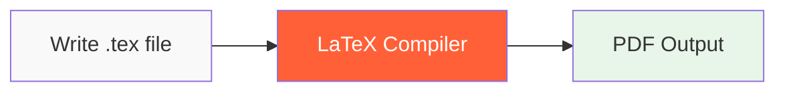

import { Card, CardGroup, Info, Tip, Warning } from '/snippets/components.mdx'

LaTeX is a high-quality typesetting system that has become the de facto standard for the communication and publication of scientific documents. But it's much more than just a tool for scientists – it's a powerful system for creating any professional document.

## LaTeX vs Word Processors

### Traditional Word Processors (Word, Google Docs)

<div style={{display: 'flex', alignItems: 'center', gap: '20px', marginBottom: '20px'}}>
  <div style={{flex: 1}}>
    **What You See Is What You Get (WYSIWYG)**
    - You format as you type
    - Focus on appearance while writing
    - Manual formatting for each element
    - Inconsistent styling across documents
  </div>
  <div style={{flex: 1, backgroundColor: '#f5f5f5', padding: '20px', borderRadius: '8px'}}>
    ```
    [Toolbar with formatting buttons]
    
    My Document
    [Manually make title big and bold]
    
    This is my text with some 
    bold words that I click to format.
    ```
  </div>
</div>

### LaTeX Approach

<div style={{display: 'flex', alignItems: 'center', gap: '20px', marginBottom: '20px'}}>
  <div style={{flex: 1}}>
    **What You See Is What You Mean (WYSIWYM)**
    - You describe structure, not appearance
    - Focus on content while writing
    - Consistent, professional formatting
    - Separation of content and style
  </div>
  <div style={{flex: 1, backgroundColor: '#f5f5f5', padding: '20px', borderRadius: '8px'}}>
    ```latex
    \documentclass{article}
    \title{My Document}
    \begin{document}
    \maketitle
    
    This is my text with some 
    \textbf{bold} words using commands.
    \end{document}
    ```
  </div>
</div>

## Why Choose LaTeX?

### 1. **Professional Typography**

LaTeX produces publication-quality documents with superior typography:

- Perfect mathematical equations
- Consistent spacing and formatting
- Professional ligatures and kerning
- Optimal line breaking and justification

<Info>
LaTeX was created by Donald Knuth, a computer scientist who was dissatisfied with the quality of his published papers. He spent years perfecting the typography algorithms.
</Info>

### 2. **Content-First Approach**

Write first, format once:
- Focus on your ideas, not formatting
- Consistent styling throughout your document
- Easy to change entire document style
- No manual formatting needed

### 3. **Superior Math Support**

Compare these examples:

**Word Processor Attempt:**
```
x = (-b ± √(b² - 4ac)) / 2a
```

**LaTeX Result:**
```latex
$x = \frac{-b \pm \sqrt{b^2 - 4ac}}{2a}$
```

Renders as: *x = (-b ± √(b² - 4ac)) / 2a* (but perfectly formatted)

### 4. **Version Control Friendly**

- Plain text files work with Git
- Track changes meaningfully
- Collaborate without conflicts
- No binary file corruption

### 5. **Cross-Reference Management**

- Automatic numbering of sections, figures, tables
- Smart references that update automatically
- Bibliography management with BibTeX
- Table of contents generation

## Real-World LaTeX Examples

### Academic Paper

<div style={{display: 'grid', gridTemplateColumns: '1fr 1fr', gap: '20px', marginBottom: '20px'}}>
  <div>
    **LaTeX Code:**
    ```latex
    \documentclass{article}
    \usepackage{amsmath}
    
    \title{Quantum Mechanics}
    \author{Dr. Smith}
    
    \begin{document}
    \maketitle
    \begin{abstract}
    This paper explores...
    \end{abstract}
    
    \section{Introduction}
    The Schrödinger equation:
    \begin{equation}
    i\hbar\frac{\partial}{\partial t}
    \Psi = \hat{H}\Psi
    \end{equation}
    \end{document}
    ```
  </div>
  <div style={{backgroundColor: '#f9f9f9', padding: '20px', borderRadius: '8px'}}>
    **Professional Output:**
    - Perfectly formatted title
    - Proper abstract block
    - Numbered sections
    - Beautiful equations
    - Consistent styling
  </div>
</div>

### Business Report

<div style={{display: 'grid', gridTemplateColumns: '1fr 1fr', gap: '20px', marginBottom: '20px'}}>
  <div>
    **LaTeX Code:**
    ```latex
    \documentclass{report}
    \usepackage{graphicx}
    
    \title{Annual Report 2024}
    \author{Finance Department}
    
    \begin{document}
    \maketitle
    \tableofcontents
    
    \chapter{Executive Summary}
    This year showed growth...
    
    \chapter{Financial Results}
    \section{Revenue}
    See Figure \ref{fig:revenue}...
    \end{document}
    ```
  </div>
  <div style={{backgroundColor: '#f9f9f9', padding: '20px', borderRadius: '8px'}}>
    **Professional Output:**
    - Automatic TOC
    - Chapter/section numbering
    - Figure references
    - Professional layout
    - Print-ready quality
  </div>
</div>

## When to Use LaTeX

### Perfect For:
- 📚 Academic papers and theses
- 🧮 Documents with lots of mathematics
- 📖 Books and long documents
- 🔬 Scientific and technical reports
- 📊 Documents with many cross-references
- 🎓 CVs and resumes
- 📽️ Professional presentations

### Maybe Not Ideal For:
- 📝 Quick notes or memos
- 🎨 Heavily designed marketing materials
- 📱 Documents needing specific layouts
- ⏱️ Last-minute documents

<Tip>
**Rule of thumb**: If you'll use the document once, use Word. If you'll reuse the format or need professional quality, use LaTeX.
</Tip>

## How LaTeX Works



1. **Write**: Create a plain text file with LaTeX commands
2. **Compile**: Run LaTeX to process your document
3. **Output**: Get a beautiful PDF (or other formats)

## Common Misconceptions

<Warning>
**Myth**: "LaTeX is only for academics"  
**Truth**: While popular in academia, LaTeX is used by publishers, businesses, and anyone wanting professional documents.

**Myth**: "LaTeX is too hard to learn"  
**Truth**: Basic LaTeX can be learned in 30 minutes. You don't need to know everything to start.

**Myth**: "LaTeX is outdated"  
**Truth**: LaTeX is actively developed and has modern packages for everything from presentations to posters.
</Warning>

## The LaTeX Ecosystem

### Core Components

<CardGroup cols={2}>
  <Card title="TeX" icon="gear">
    The underlying typesetting engine
  </Card>
  <Card title="LaTeX" icon="layer-group">
    User-friendly macros built on TeX
  </Card>
  <Card title="Packages" icon="box">
    Extensions for additional features
  </Card>
  <Card title="Classes" icon="file">
    Document templates (article, book, etc.)
  </Card>
</CardGroup>

### Popular Distributions

- **TeX Live**: Comprehensive, cross-platform
- **MiKTeX**: Popular on Windows
- **MacTeX**: TeX Live for macOS
- **Online**: LaTeX Cloud Studio and other online editors

## Getting Started

Ready to begin your LaTeX journey? Here are your next steps:

1. **Learn the Basics**: Start with our [30-minute tutorial](/learn/latex-in-30-minutes)
2. **Try It Online**: Use an online editor to experiment without installation
3. **Pick a Project**: Choose a simple document to recreate in LaTeX
4. **Join the Community**: Get help when you need it

<Info>
**Did you know?** Major publishers like Springer, Elsevier, and IEEE prefer LaTeX submissions because of its quality and consistency.
</Info>

## Summary

LaTeX is more than just a typesetting system – it's a different philosophy of document creation. Instead of fighting with formatting while you write, you focus on your content and let LaTeX handle the professional presentation.

Whether you're writing your first research paper, creating a thesis, or just want beautifully formatted documents, LaTeX provides the tools you need for professional results.

---

Ready to create your first LaTeX document? Continue with our [30-minute quick start guide](/learn/latex-in-30-minutes) or dive into [document basics](/learn/latex/basics/first-document).