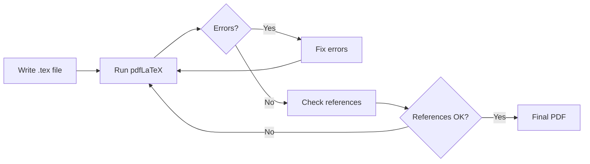

This comprehensive guide walks you through creating your first LaTeX project from scratch, covering everything from initial setup to producing a polished PDF document.

<Info>
**Time to complete**: 15-20 minutes  
**Prerequisites**: Access to LaTeX Cloud Studio or a LaTeX installation  
**Outcome**: A complete, well-structured LaTeX document
</Info>

## Project Planning

### Before You Start

Before creating your LaTeX project, consider:

1. **Document type** - Article, report, book, or presentation?
2. **Required features** - Math equations, images, tables, bibliography?
3. **Output format** - PDF for print or digital distribution?
4. **Collaboration needs** - Working alone or with others?

### Choosing the Right Document Class

<CardGroup cols={2}>
<Card title="article" icon="file-text">
Best for papers, essays, and short documents
- Sections start at top level
- No chapters
- Compact layout
</Card>
<Card title="report" icon="file-contract">
Ideal for longer documents with chapters
- Title page by default
- Abstract support
- Chapter organization
</Card>
<Card title="book" icon="book">
Full-length books and manuals
- Front/back matter
- Two-sided printing
- Professional typography
</Card>
<Card title="beamer" icon="presentation-screen">
Presentations and slides
- Frame-based content
- Themes and transitions
- Speaker notes
</Card>
</CardGroup>

## Step 1: Create Project Structure

### Basic Project Setup

<CodeGroup>
```latex main.tex
\documentclass[12pt, a4paper]{article}

% Preamble - Package imports and settings
\usepackage[utf8]{inputenc}
\usepackage[T1]{fontenc}
\usepackage[english]{babel}
\usepackage{amsmath, amssymb, amsthm}
\usepackage{graphicx}
\usepackage[margin=1in]{geometry}
\usepackage{hyperref}

% Document metadata
\title{My First LaTeX Document}
\author{Your Name}
\date{\today}

% Document content
\begin{document}

\maketitle

\begin{abstract}
This is my first LaTeX document, demonstrating the basic structure
and common elements used in academic writing.
\end{abstract}

\tableofcontents
\newpage

\section{Introduction}
Welcome to LaTeX! This document will help you understand the basics
of document creation and formatting.

\section{Getting Started}
Let's explore the fundamental concepts and features of LaTeX.

\subsection{Why Use LaTeX?}
LaTeX offers several advantages:
\begin{itemize}
    \item Professional typesetting
    \item Excellent mathematical notation
    \item Automatic numbering and references
    \item Consistent formatting
\end{itemize}

\section{Conclusion}
You've successfully created your first LaTeX document!

\end{document}
```
</CodeGroup>

### Understanding the Structure

#### Preamble Section
The preamble (before `\begin{document}`) contains:
- **Document class**: Defines overall layout
- **Packages**: Add functionality
- **Settings**: Configure appearance
- **Metadata**: Title, author, date

#### Document Body
The main content (between `\begin{document}` and `\end{document}`) contains:
- **Front matter**: Title, abstract, table of contents
- **Main content**: Sections, paragraphs, lists
- **Back matter**: Bibliography, appendices

## Step 2: Add Essential Packages

### Core Package Set

<CodeGroup>
```latex essential-packages.tex
% Essential packages for any document
\usepackage[utf8]{inputenc}          % Input encoding
\usepackage[T1]{fontenc}             % Font encoding
\usepackage[english]{babel}          % Language support
\usepackage{geometry}                % Page layout
\usepackage{graphicx}                % Images
\usepackage{hyperref}                % Clickable links

% Math and science
\usepackage{amsmath, amssymb}        % Math symbols and environments
\usepackage{siunitx}                 % SI units

% Tables and lists
\usepackage{booktabs}                % Professional tables
\usepackage{enumitem}                % List customization

% References and citations
\usepackage{biblatex}                % Bibliography
\addbibresource{references.bib}      % Bibliography file
```
</CodeGroup>

### Package Categories

<Tabs>
<Tab title="Typography">
```latex
\usepackage{microtype}     % Subtle typography improvements
\usepackage{fontspec}      % Custom fonts (XeLaTeX/LuaLaTeX)
\usepackage{lmodern}       % Latin Modern fonts
\usepackage{setspace}      % Line spacing control
```
</Tab>
<Tab title="Graphics">
```latex
\usepackage{tikz}          % Drawings and diagrams
\usepackage{pgfplots}      % Plots and charts
\usepackage{subcaption}    % Subfigures
\usepackage{wrapfig}       % Text wrapping
```
</Tab>
<Tab title="Code">
```latex
\usepackage{listings}      % Code listings
\usepackage{minted}        % Syntax highlighting
\usepackage{algorithm2e}   % Algorithms
\usepackage{verbatim}      % Verbatim text
```
</Tab>
<Tab title="Layout">
```latex
\usepackage{multicol}      % Multiple columns
\usepackage{fancyhdr}      % Headers and footers
\usepackage{titlesec}      % Section formatting
\usepackage{tocloft}       % TOC customization
```
</Tab>
</Tabs>

## Step 3: Write Content

### Text Formatting

<CodeGroup>
```latex text-formatting.tex
\section{Text Formatting Examples}

% Basic formatting
This is \textbf{bold text}, \textit{italic text}, and \underline{underlined text}.
You can also combine them: \textbf{\textit{bold italic}}.

% Font sizes
{\tiny tiny} {\small small} {\normalsize normal} {\large large} {\huge huge}

% Emphasis and quotes
\emph{Emphasized text} adapts to context. Use ``double quotes'' for quotations.

% Paragraph formatting
\paragraph{Named paragraph} This creates a named paragraph with special formatting.

% Line breaks and spacing
First line\\
Second line with forced break

First paragraph.

Second paragraph with extra spacing.
```
</CodeGroup>

### Lists and Enumerations

<CodeGroup>
```latex lists.tex
% Bullet points
\begin{itemize}
    \item First item
    \item Second item
    \begin{itemize}
        \item Nested item
        \item Another nested item
    \end{itemize}
    \item Third item
\end{itemize}

% Numbered lists
\begin{enumerate}
    \item First step
    \item Second step
    \item Third step
\end{enumerate}

% Description lists
\begin{description}
    \item[LaTeX] A document preparation system
    \item[PDF] Portable Document Format
    \item[BibTeX] Bibliography management tool
\end{description}

% Custom lists with enumitem
\usepackage{enumitem}
\begin{enumerate}[label=(\alph*)]
    \item First item with (a)
    \item Second item with (b)
\end{enumerate}
```
</CodeGroup>

## Step 4: Add Visual Elements

### Including Images

<CodeGroup>
```latex images.tex
\section{Working with Images}

% Simple image inclusion
\begin{figure}[htbp]
    \centering
    \includegraphics[width=0.8\textwidth]{example-image}
    \caption{A sample image with descriptive caption}
    \label{fig:example}
\end{figure}

% Multiple images side by side
\begin{figure}[htbp]
    \centering
    \begin{subfigure}{0.45\textwidth}
        \includegraphics[width=\textwidth]{image1}
        \caption{First image}
    \end{subfigure}
    \hfill
    \begin{subfigure}{0.45\textwidth}
        \includegraphics[width=\textwidth]{image2}
        \caption{Second image}
    \end{subfigure}
    \caption{Two images side by side}
    \label{fig:comparison}
\end{figure}

As shown in Figure~\ref{fig:example}, images can be easily referenced.
```
</CodeGroup>

### Creating Tables

<CodeGroup>
```latex tables.tex
\section{Tables}

% Simple table
\begin{table}[htbp]
    \centering
    \caption{Sample data table}
    \label{tab:sample}
    \begin{tabular}{lcc}
        \toprule
        Item & Quantity & Price \\
        \midrule
        Apples & 5 & \$2.50 \\
        Oranges & 3 & \$1.80 \\
        Bananas & 6 & \$3.00 \\
        \bottomrule
    \end{tabular}
\end{table}

Table~\ref{tab:sample} shows a professional table using booktabs.
```
</CodeGroup>

## Step 5: Mathematical Content

### Equations and Formulas

<CodeGroup>
```latex mathematics.tex
\section{Mathematical Expressions}

% Inline math
The quadratic formula is $x = \frac{-b \pm \sqrt{b^2 - 4ac}}{2a}$.

% Display equation with number
\begin{equation}
    E = mc^2
    \label{eq:einstein}
\end{equation}

% Multiple aligned equations
\begin{align}
    f(x) &= x^2 + 2x + 1 \\
         &= (x + 1)^2
\end{align}

% Matrices
\begin{equation}
    A = \begin{bmatrix}
        1 & 2 & 3 \\
        4 & 5 & 6 \\
        7 & 8 & 9
    \end{bmatrix}
\end{equation}

As shown in Equation~\ref{eq:einstein}, mass and energy are related.
```
</CodeGroup>

## Step 6: Compile Your Document

### Compilation Process

1. **Save your file** with `.tex` extension
2. **Choose compiler**:
   - **pdfLaTeX**: Standard choice, fast compilation
   - **XeLaTeX**: Unicode and system fonts
   - **LuaLaTeX**: Advanced features
3. **Run compilation** (may need 2-3 passes)
4. **Check output** for errors and warnings

### Common Compilation Issues

<Warning>
**Fix these common errors**:
- **Missing `$`**: Math mode not properly closed
- **Undefined control sequence**: Typo in command or missing package
- **Missing `\end{}`**: Environment not closed
- **File not found**: Check image paths and filenames
</Warning>

### Compilation Workflow



## Step 7: Add References

### Bibliography Management

<CodeGroup>
```latex bibliography.tex
% In preamble
\usepackage{biblatex}
\addbibresource{references.bib}

% In document
\section{Literature Review}

According to \textcite{knuth1984}, TeX is a typesetting system.
The LaTeX system \parencite{lamport1994} builds upon TeX.
Recent developments are discussed in \cite{modern2023}.

% At document end
\printbibliography
```

```bibtex references.bib
@book{knuth1984,
    author = {Knuth, Donald E.},
    title = {The {\TeX}book},
    year = {1984},
    publisher = {Addison-Wesley}
}

@book{lamport1994,
    author = {Lamport, Leslie},
    title = {\LaTeX: A Document Preparation System},
    year = {1994},
    publisher = {Addison-Wesley}
}

@article{modern2023,
    author = {Smith, John and Doe, Jane},
    title = {Modern \LaTeX{} Techniques},
    journal = {Journal of Typesetting},
    year = {2023},
    volume = {15},
    pages = {123--145}
}
```
</CodeGroup>

## Project Organization

### File Structure

```
my-project/
├── main.tex           # Main document
├── chapters/          # Chapter files
│   ├── intro.tex
│   ├── methods.tex
│   └── results.tex
├── figures/           # Images and diagrams
│   ├── plot1.pdf
│   └── diagram.png
├── references.bib     # Bibliography
└── style.sty         # Custom styles
```

### Multi-file Projects

<CodeGroup>
```latex main-multi.tex
\documentclass{report}
% ... preamble ...

\begin{document}

\include{chapters/intro}
\include{chapters/methods}
\include{chapters/results}

\printbibliography

\end{document}
```

```latex chapters/intro.tex
\chapter{Introduction}
\label{ch:intro}

This chapter introduces the research topic...

\section{Background}
The background of this research...
```
</CodeGroup>

## Best Practices

<Tip>
**Follow these guidelines for professional documents**:

1. **Consistent style** - Use the same formatting throughout
2. **Meaningful labels** - `\label{fig:data-analysis}` not `\label{fig1}`
3. **Regular compilation** - Catch errors early
4. **Version control** - Track changes with Git
5. **Modular structure** - Split large documents into files
6. **Comments** - Document complex code with `%` comments
</Tip>

## Complete Example Project

<CodeGroup>
```latex complete-project.tex
\documentclass[12pt, a4paper]{article}

% ==================
% PREAMBLE
% ==================
% Encoding and fonts
\usepackage[utf8]{inputenc}
\usepackage[T1]{fontenc}
\usepackage{lmodern}

% Language
\usepackage[english]{babel}

% Page layout
\usepackage[margin=1in]{geometry}
\usepackage{setspace}
\onehalfspacing

% Graphics and color
\usepackage{graphicx}
\usepackage[dvipsnames]{xcolor}

% Math packages
\usepackage{amsmath, amssymb, amsthm}

% Tables
\usepackage{booktabs}
\usepackage{array}

% References
\usepackage{hyperref}
\hypersetup{
    colorlinks=true,
    linkcolor=blue,
    citecolor=green,
    urlcolor=red
}

% Bibliography
\usepackage{biblatex}
\addbibresource{references.bib}

% Custom commands
\newcommand{\R}{\mathbb{R}}
\newcommand{\important}[1]{\textcolor{red}{\textbf{#1}}}

% Theorem environments
\newtheorem{theorem}{Theorem}[section]
\newtheorem{lemma}[theorem]{Lemma}

% Document info
\title{A Complete LaTeX Project Example}
\author{Your Name\\
\small Department of Computer Science\\
\small University Name}
\date{\today}

% ==================
% DOCUMENT BODY
% ==================
\begin{document}

\maketitle

\begin{abstract}
This document demonstrates a complete LaTeX project structure,
including all common elements used in academic writing. It serves
as a template for creating professional documents.
\end{abstract}

\tableofcontents
\newpage

\section{Introduction}
\label{sec:intro}

LaTeX is a powerful typesetting system particularly suited for
technical and scientific documentation. This document demonstrates
its capabilities through practical examples.

\subsection{Motivation}
The motivation for using LaTeX includes:
\begin{itemize}
    \item Superior mathematical typesetting
    \item Consistent document formatting
    \item Excellent bibliography management
    \item Cross-platform compatibility
\end{itemize}

\section{Mathematical Content}
\label{sec:math}

\subsection{Equations}
The quadratic equation \cite{mathbook2020} is given by:
\begin{equation}
    ax^2 + bx + c = 0
    \label{eq:quadratic}
\end{equation}

The solutions to Equation~\eqref{eq:quadratic} are:
\begin{equation}
    x = \frac{-b \pm \sqrt{b^2 - 4ac}}{2a}
\end{equation}

\subsection{Theorems}
\begin{theorem}[Pythagorean Theorem]
\label{thm:pythagoras}
In a right triangle with legs $a$ and $b$ and hypotenuse $c$:
\begin{equation}
    a^2 + b^2 = c^2
\end{equation}
\end{theorem}

\begin{proof}
The proof follows from geometric considerations...
\end{proof}

\section{Tables and Figures}
\label{sec:visual}

\subsection{Tables}
Table~\ref{tab:results} shows experimental results.

\begin{table}[htbp]
    \centering
    \caption{Experimental results}
    \label{tab:results}
    \begin{tabular}{lccc}
        \toprule
        Method & Accuracy & Precision & Recall \\
        \midrule
        Baseline & 0.85 & 0.82 & 0.88 \\
        Improved & 0.92 & 0.90 & 0.94 \\
        \important{Proposed} & \important{0.96} & \important{0.95} & \important{0.97} \\
        \bottomrule
    \end{tabular}
\end{table}

\subsection{Figures}
Figure~\ref{fig:example} shows an example image.

\begin{figure}[htbp]
    \centering
    \includegraphics[width=0.6\textwidth]{example-image}
    \caption{Example figure with caption}
    \label{fig:example}
\end{figure}

\section{Code Listings}
\label{sec:code}

Here's an example algorithm:

\begin{verbatim}
def fibonacci(n):
    if n <= 1:
        return n
    return fibonacci(n-1) + fibonacci(n-2)
\end{verbatim}

\section{Conclusion}
\label{sec:conclusion}

This document has demonstrated the essential elements of a LaTeX
project. For more information, see \cite{latex2023}.

\printbibliography

\appendix
\section{Additional Resources}
\begin{itemize}
    \item Official LaTeX documentation
    \item TeX Stack Exchange
    \item LaTeX Wikibook
\end{itemize}

\end{document}
```
</CodeGroup>

## Next Steps

Now that you've created your first project:

1. **Experiment with packages** - Try TikZ for diagrams or minted for code
2. **Create templates** - Save time on future projects
3. **Learn advanced features** - Master bibliographies and cross-references
4. **Join the community** - Get help on forums and Stack Exchange

<CardGroup cols={2}>
<Card title="Working with Images" icon="image" href="/learn/latex/how-to/working-with-images">
Learn image inclusion, positioning, and formatting
</Card>
<Card title="Creating Tables" icon="table" href="/learn/latex/how-to/professional-tables">
Master professional table creation and formatting
</Card>
<Card title="Managing Large Documents" icon="folder" href="/learn/latex/how-to/large-documents">
Organize multi-file projects effectively
</Card>
<Card title="Fix Errors" icon="bug" href="/learn/latex/how-to/fixing-errors">
Troubleshoot common compilation problems
</Card>
</CardGroup>

## Quick Reference

### Essential Commands

| Command | Purpose | Example |
|---------|---------|---------|
| `\documentclass{}` | Set document type | `\documentclass{article}` |
| `\usepackage{}` | Load package | `\usepackage{graphicx}` |
| `\section{}` | Create section | `\section{Introduction}` |
| `\label{}` | Create reference | `\label{sec:intro}` |
| `\ref{}` | Reference label | `\ref{sec:intro}` |
| `\cite{}` | Cite reference | `\cite{knuth1984}` |

---

<Info>
**Congratulations!** You've successfully created your first LaTeX project. Continue exploring our guides to master advanced features and create professional documents.
</Info>