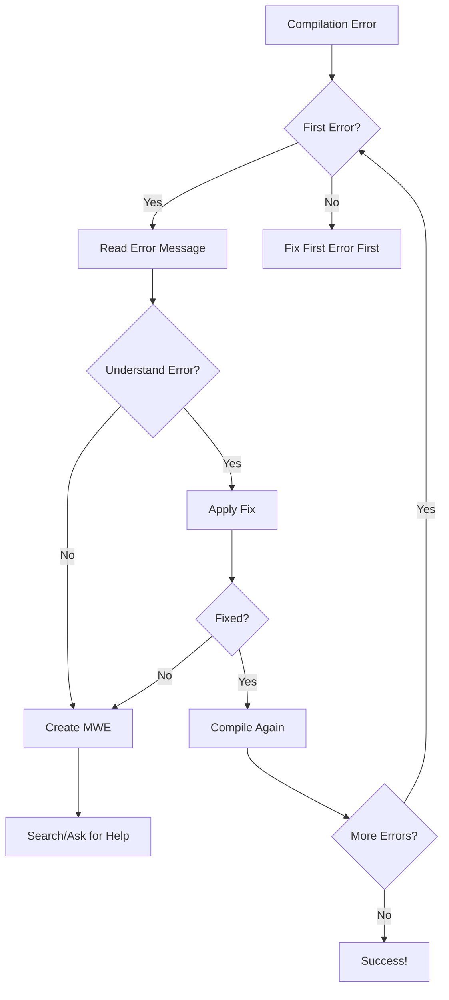

Learn to diagnose and fix LaTeX compilation errors efficiently. This comprehensive guide covers error types, debugging strategies, common problems with solutions, and preventive measures to keep your documents compiling smoothly.

<Info>
**Prerequisites**: Basic LaTeX knowledge  
**Time to complete**: 30-35 minutes  
**Difficulty**: Intermediate to Advanced  
**What you'll learn**: Error types, debugging tools, common fixes, and prevention strategies
</Info>

## Understanding LaTeX Errors

### Error Message Structure

<CodeGroup>
```bash error-anatomy.log
! LaTeX Error: File `missing-package.sty' not found.
^^^^^^^^^^^^^^^^^^^^^^^^^^^^^^^^^^^^^^^^^^^^^^^^^^^^^^^
Type of error and description

See the LaTeX manual or LaTeX Companion for explanation.
Type  H <return>  for immediate help.
 ...                                              
                                                  
l.5 \usepackage{missing-package}
^^^^^^^^^^^^^^^^^^^^^^^^^^^^^^^^
Line number and problematic code

? 
^ Prompt for user action (press Enter to continue)
```

```bash error-components.txt
Components of an error message:
1. ! - Error indicator
2. Error type - LaTeX Error, TeX capacity exceeded, etc.
3. Description - What went wrong
4. Line number (l.XX) - Where it occurred
4. Context - Code causing the error
5. Help prompt - Type H for more info
```
</CodeGroup>

### Error Categories

<Tabs>
<Tab title="LaTeX Errors">
**Structural/syntax errors**
- Missing braces `{}`
- Unclosed environments
- Undefined commands
- Missing packages
- Invalid options
</Tab>
<Tab title="TeX Errors">
**Low-level system errors**
- Memory exceeded
- Dimension too large
- Missing characters
- Font issues
- File I/O problems
</Tab>
<Tab title="Package Errors">
**Package-specific issues**
- Incompatible packages
- Missing dependencies
- Option conflicts
- Version mismatches
</Tab>
<Tab title="Warnings">
**Non-fatal issues**
- Overfull/underfull boxes
- Font substitutions
- Multiply defined labels
- Citation undefined
</Tab>
</Tabs>

## Common Errors and Solutions

### Missing Package Errors

<CodeGroup>
```latex missing-package-fix.tex
% Error: File `tikz.sty' not found

% Solution 1: Install missing package
% - TeX Live: tlmgr install pgf
% - MiKTeX: Use package manager
% - Manual: Download from CTAN

% Solution 2: Check package name
\usepackage{tikz}     % Correct
\usepackage{TikZ}     % Wrong - case sensitive
\usepackage{tikz-cd}  % Different package

% Solution 3: Update distribution
% Run: tlmgr update --all

% Solution 4: Check TEXMF path
% Ensure custom packages are in path
```

```latex undefined-control-sequence.tex
% Error: Undefined control sequence

% Problem 1: Typo in command
\textbf{Bold text}    % Correct
\textbold{Bold text}  % Wrong - undefined

% Problem 2: Missing package
\SI{10}{\meter}       % Error without siunitx
\usepackage{siunitx}  % Add this first

% Problem 3: Wrong order
\alpha                % Error in text mode
$\alpha$              % Correct - math mode

% Problem 4: Custom command not defined
\mycommand{text}      % Error if not defined
\newcommand{\mycommand}[1]{#1}  % Define first
```
</CodeGroup>

### Environment Errors

<CodeGroup>
```latex environment-mismatch.tex
% Error: \begin{itemize} ended by \end{enumerate}

% Wrong:
\begin{itemize}
\item First item
\item Second item
\end{enumerate}  % Mismatched

% Correct:
\begin{itemize}
\item First item
\item Second item
\end{itemize}

% Common mismatches:
% - equation/align
% - table/tabular
% - figure/center
% - document/article

% Prevention: Use editor matching
% Most editors highlight matching begin/end
```

```latex missing-begin-end.tex
% Error: Missing \begin{document}

% Structure required:
\documentclass{article}
% Preamble here
\begin{document}  % Required!
Content here
\end{document}

% Error: No \end{} to match \begin{equation}
\begin{equation}
E = mc^2
% Missing \end{equation}

% Debugging tip: Count begin/end pairs
grep -c "\\\\begin{" file.tex
grep -c "\\\\end{" file.tex
# Should be equal
```
</CodeGroup>

### Math Mode Errors

<CodeGroup>
```latex math-mode-issues.tex
% Error: Missing $ inserted

% Problem: Math symbols in text mode
The variable α represents...  % Error
The variable $\alpha$ represents...  % Correct

% Problem: Text in math mode
$the value of x = 5$  % Wrong
$\text{the value of } x = 5$  % Better
The value of $x = 5$  % Best

% Problem: Display math syntax
$$E = mc^2$$  % Deprecated
\[E = mc^2\]  % Correct

% Problem: Nested math modes
$the formula $x^2$ is$  % Error
$\text{the formula } x^2 \text{ is}$  % Correct
```

```latex math-delimiter-errors.tex
% Error: Missing delimiter

% Mismatched delimiters
$\left( x + y \right]$  % Wrong bracket types
$\left( x + y \right)$  % Correct

% Missing \right
$\left( \frac{a}{b} $  % Error
$\left( \frac{a}{b} \right)$  % Correct

% Size mismatch
\left( x \right.  % OK - invisible right
\left. x \right)  % OK - invisible left

% Multi-line issues
\begin{align}
\left( x + y  % Error - can't break
\right)
\end{align}

% Solution for multi-line
\begin{align}
\Bigl( x &+ y \\
      &+ z \Bigr)
\end{align}
```
</CodeGroup>

### Table and Figure Errors

<CodeGroup>
```latex table-errors.tex
% Error: Misplaced \noalign

% Problem: Commands outside table
\begin{tabular}{cc}
\hline  % OK
Content & More \\
\hline  % OK
\caption{Table}  % Error - not allowed
\end{tabular}

% Solution: Use table environment
\begin{table}
\caption{Table}  % Correct placement
\begin{tabular}{cc}
\hline
Content & More \\
\hline
\end{tabular}
\end{table}

% Error: Illegal character in array arg
\begin{tabular}{l|c|r}  % Vertical lines ok
\begin{tabular}{lcr|}   % Error - trailing |
\begin{tabular}{|lcr}   % OK - leading |
```

```latex figure-placement-errors.tex
% Error: Not in outer par mode

% Problem: Figure in wrong place
\begin{itemize}
\item Some text
\begin{figure}[h]  % Error - can't nest
\includegraphics{image}
\end{figure}
\end{itemize}

% Solution 1: Move outside list
\begin{itemize}
\item Some text
\end{itemize}

\begin{figure}[h]
\includegraphics{image}
\end{figure}

% Solution 2: Use different approach
\begin{itemize}
\item Some text with image:\\
\includegraphics[width=0.5\textwidth]{image}
\end{itemize}
```
</CodeGroup>

### Reference and Citation Errors

<CodeGroup>
```latex reference-errors.tex
% Warning: Reference `fig:missing' undefined

% Problem: Label doesn't exist
See Figure~\ref{fig:missing}  % Warning

% Solutions:
% 1. Add the label
\begin{figure}
\includegraphics{image}
\caption{Caption}
\label{fig:missing}  % Add this
\end{figure}

% 2. Check label spelling
\label{fig:myimage}
\ref{fig:myImage}  % Case sensitive!

% 3. Compile twice
% First run: Collect labels
% Second run: Resolve references

% Prevention: Systematic naming
\label{fig:intro:example}
\label{tab:results:summary}
\label{eq:theory:main}
```

```latex citation-errors.tex
% Warning: Citation `smith2020' undefined

% Problem 1: Missing bib entry
\cite{smith2020}  % Not in .bib file

% Solution: Add to bibliography
@article{smith2020,
  author = {Smith, John},
  title = {Article Title},
  journal = {Journal Name},
  year = {2020}
}

% Problem 2: Wrong bibliography file
\bibliography{refs}     % Looking for refs.bib
\bibliography{references}  % Actual file: references.bib

% Problem 3: Compilation order
pdflatex main
bibtex main      % Run this!
pdflatex main
pdflatex main

% Problem 4: Backend mismatch
\usepackage{biblatex}  % Uses biber
% Run: biber main (not bibtex)
```
</CodeGroup>

## Debugging Strategies

### Log File Analysis

<CodeGroup>
```bash reading-log-files.sh
# Understanding log files

# 1. Find first error
grep -n "^!" main.log | head -1

# 2. Extract error context
sed -n '/^!/,/^$/p' main.log

# 3. Count warnings
grep -c "Warning:" main.log

# 4. Find undefined references
grep "undefined" main.log

# 5. Check overfull boxes
grep "Overfull" main.log | wc -l
```

```latex debug-mode.tex
% Enable detailed debugging

% Show all warnings
\errorcontextlines=10000

% Track undefined references
\usepackage{refcheck}

% Show keys for labels
\usepackage{showkeys}

% Draft mode for faster debugging
\documentclass[draft]{article}

% Visual debugging
\overfullrule=5pt  % Show overfull boxes
\showboxdepth=10   % More detail in log
\showboxbreadth=10

% Trace package loading
\listfiles  % Lists all loaded files
```
</CodeGroup>

### Minimal Working Example (MWE)

<CodeGroup>
```latex create-mwe.tex
% Step 1: Start with problematic document
% Step 2: Remove content until error disappears
% Step 3: Add back until error returns

% MWE template
\documentclass{article}
\usepackage{minimal-packages-only}

\begin{document}
% Minimal content that reproduces error
Only include what's necessary to show the problem
\end{document}

% Good MWE example for table error:
\documentclass{article}
\usepackage{booktabs}
\begin{document}
\begin{tabular}{cc}
\toprule
A & B \\
\bottomrule
\end{tabular}
\end{document}
```

```bash binary-search-debug.sh
#!/bin/bash
# Binary search for errors in large documents

# 1. Comment out half the document
# 2. If error persists, problem in first half
# 3. If error gone, problem in second half
# 4. Repeat until found

# Automated approach
cat > debug-wrapper.tex << 'EOF'
\documentclass{article}
\begin{document}
\input{test-content}
\end{document}
EOF

# Test sections individually
for file in chapters/*.tex; do
    echo "Testing $file..."
    cp "$file" test-content.tex
    if ! pdflatex -interaction=nonstopmode debug-wrapper.tex > /dev/null 2>&1; then
        echo "Error found in $file"
    fi
done
```
</CodeGroup>

## Error Prevention

### Best Practices

<Tip>
**Prevent errors before they happen**:

1. **Regular compilation** - Compile frequently to catch errors early
2. **Version control** - Track changes and revert if needed
3. **Modular structure** - Isolate problems to specific files
4. **Consistent style** - Use templates and conventions
5. **Package management** - Keep packages updated
6. **Editor features** - Use syntax highlighting and checking
7. **Comments** - Document complex code
8. **Backup** - Always have working versions
</Tip>

### Pre-compilation Checks

<CodeGroup>
```latex pre-checks.tex
% Add checks to document preamble

% Check for required packages
\RequirePackage{iftex}
\ifPDFTeX
    \PackageInfo{mydoc}{Using PDFLaTeX}
\else
    \PackageError{mydoc}{Requires PDFLaTeX}{Please compile with pdflatex}
\fi

% Version checks
\NeedsTeXFormat{LaTeX2e}[2020/01/01]

% Compatibility checks
\@ifpackageloaded{hyperref}{}{
    \PackageWarning{mydoc}{hyperref recommended}
}

% Custom sanity checks
\newcommand{\checksetup}{%
    \@ifundefined{mycommand}{
        \PackageError{mydoc}{Setup incomplete}{Run \string\setupmydoc first}
    }{}
}
```

```bash validation-script.sh
#!/bin/bash
# Pre-compilation validation

echo "LaTeX Document Validator"

# Check file exists
if [ ! -f "$1" ]; then
    echo "Error: File $1 not found"
    exit 1
fi

# Check syntax
echo "Checking syntax..."
lacheck "$1"

# Check style
echo "Checking style..."
chktex "$1"

# Check references
echo "Checking references..."
grep -n "ref{" "$1" | grep -v "label{" | grep -v "pageref{" | grep -v "autoref{" | grep -v "cref{"

# Check for common issues
echo "Checking common issues..."
grep -n "\$\$" "$1" && echo "Warning: Found deprecated \$\$ math"
grep -n "\\def\\" "$1" && echo "Warning: Found \\def (use \\newcommand)"

echo "Validation complete"
```
</CodeGroup>

## Advanced Debugging

### Memory and Capacity Errors

<CodeGroup>
```latex capacity-exceeded.tex
% Error: TeX capacity exceeded

% Problem: Too many labels/refs
% Solution: Increase memory
% Edit texmf.cnf or set environment:
% export extra_mem_top=10000000

% Problem: Dimension too large
\vspace{100000pt}  % Error
\vspace{100cm}     % OK if fits on page

% Problem: Too deeply nested
% Solution: Restructure document
% Avoid >6 levels of nesting

% Problem: Hash size exceeded
% Too many commands/labels
% Solution: Clean auxiliary files
% rm *.aux *.toc *.lof *.lot
```

```latex infinite-loops.tex
% Detecting infinite loops

% Problem: Recursive macro
\newcommand{\recur}{\recur}  % Infinite loop
\recur  % Crashes

% Solution: Add termination
\newcounter{depth}
\newcommand{\saferecur}{%
    \stepcounter{depth}%
    \ifnum\value{depth}<10
        \saferecur
    \fi
}

% Problem: Circular references
\label{a} See \ref{b}
\label{b} See \ref{a}
% Not infinite but confusing

% Debug with traces
\tracingmacros=1
\tracingcommands=1
% Check log file
```
</CodeGroup>

### Package Conflicts

<CodeGroup>
```latex package-conflicts.tex
% Common package conflicts and solutions

% hyperref - load last (with exceptions)
\usepackage{graphics}
\usepackage{color}
\usepackage{hyperref}  % Almost always last
\usepackage{cleveref}  % After hyperref

% inputenc vs fontenc order
\usepackage[utf8]{inputenc}  % First
\usepackage[T1]{fontenc}     % Second

% babel conflicts
\usepackage[english]{babel}
\usepackage{csquotes}  % After babel

% Math font conflicts
% Don't use multiple math font packages
% \usepackage{mathptmx}
% \usepackage{fourier}  % Conflict!

% Caption and subcaption
\usepackage{caption}
\usepackage{subcaption}  % Must be after caption
% Don't use with subfigure/subfig
```

```latex conflict-resolution.tex
% Resolving conflicts

% Option 1: Change load order
% Try different orders until working

% Option 2: Compatibility options
\usepackage[compatibility=false]{caption}

% Option 3: Alternative packages
% Instead of subfigure (deprecated)
\usepackage{subcaption}  % Modern alternative

% Option 4: Manual patches
\usepackage{etoolbox}
\AtBeginDocument{%
    % Fix specific conflicts
}

% Option 5: Minimal example
% Isolate conflict with MWE
% Report to package maintainer
```
</CodeGroup>

## Error Recovery

### Corrupted Files

<CodeGroup>
```bash file-recovery.sh
#!/bin/bash
# Recover from corrupted auxiliary files

# Clean all generated files
clean_latex() {
    local base="${1%.tex}"
    rm -f "$base".{aux,log,out,toc,lof,lot,bbl,blg,nav,snm,vrb}
    rm -f "$base".{synctex.gz,fdb_latexmk,fls}
}

# Usage
clean_latex main.tex

# Rebuild from scratch
pdflatex main.tex
bibtex main
pdflatex main.tex
pdflatex main.tex
```

```latex emergency-compilation.tex
% Emergency compilation techniques

% Skip problematic sections
\includeonly{chapters/working-chapter}

% Disable problematic packages
\PassOptionsToPackage{draft}{graphicx}

% Continue despite errors
% pdflatex -interaction=nonstopmode main.tex

% Create placeholder commands
\providecommand{\missingcmd}[1]{[MISSING: #1]}

% Temporary fixes
\usepackage{silence}
\WarningsOff[hyperref]
\ErrorsOff[some-package]
```
</CodeGroup>

## Troubleshooting Workflow

### Systematic Approach



### Quick Reference

<Warning>
**Common fixes cheat sheet**:

| Error | Quick Fix |
|-------|-----------|
| Undefined control sequence | Check spelling, load package |
| Missing $ inserted | Add $ around math |
| File not found | Check name, install package |
| Missing \begin{document} | Add document structure |
| Undefined reference | Compile twice, check label |
| Dimension too large | Reduce size value |
| Missing } inserted | Balance braces |
| Environment undefined | Load required package |
</Warning>

## Complete Debugging Example

<CodeGroup>
```latex debug-session.tex
% Document with multiple errors
\documentclass{article}
\usepackage{amsmath}
% Missing graphicx package

\begin{document}

\title{Debugging Example}
\autor{John Doe}  % Typo: should be \author
\maketitle

\section{Introduction}
This document has several errors. The equation α = β needs math mode.  % Missing $

\begin{figure}[h]
\includegraphics{nonexistent}  % Missing package and file
\caption{Test}
\label{fig:test
\end{figure}  % Missing }

See Figure \ref{fig:tset}.  % Typo in label

\begin{equaton}  % Typo: should be equation
x^2 + y^2 = z^2
\end{equation}  % Mismatch

\end{document}
```

```latex debug-fixed.tex
% Fixed version
\documentclass{article}
\usepackage{amsmath}
\usepackage{graphicx}  % Added missing package

\begin{document}

\title{Debugging Example}
\author{John Doe}  % Fixed typo
\maketitle

\section{Introduction}
This document has several errors. The equation $\alpha = \beta$ needs math mode.  % Added $

\begin{figure}[h]
\centering
\includegraphics[width=0.5\textwidth]{example-image}  % Fixed path
\caption{Test}
\label{fig:test}  % Added missing }
\end{figure}

See Figure \ref{fig:test}.  % Fixed typo

\begin{equation}  % Fixed typo
x^2 + y^2 = z^2
\end{equation}

\end{document}
```
</CodeGroup>

## Next Steps

Continue mastering LaTeX:

<CardGroup cols={2}>
<Card title="Large Documents" icon="file-code" href="/learn/latex/how-to/large-documents">
Debug multi-file projects
</Card>
<Card title="Templates" icon="copy" href="/learn/latex/how-to/templates">
Create error-free templates
</Card>
<Card title="Collaboration" icon="users" href="/learn/latex/how-to/collaboration">
Team debugging strategies
</Card>
<Card title="Package Docs" icon="book" href="/learn/reference/packages">
Understand package errors
</Card>
</CardGroup>

---

<Info>
**Remember**: Most LaTeX errors have simple solutions. Read error messages carefully, fix the first error first, and when in doubt, create a minimal example that reproduces the problem. The LaTeX community is helpful - don't hesitate to ask for help with a good MWE.
</Info>